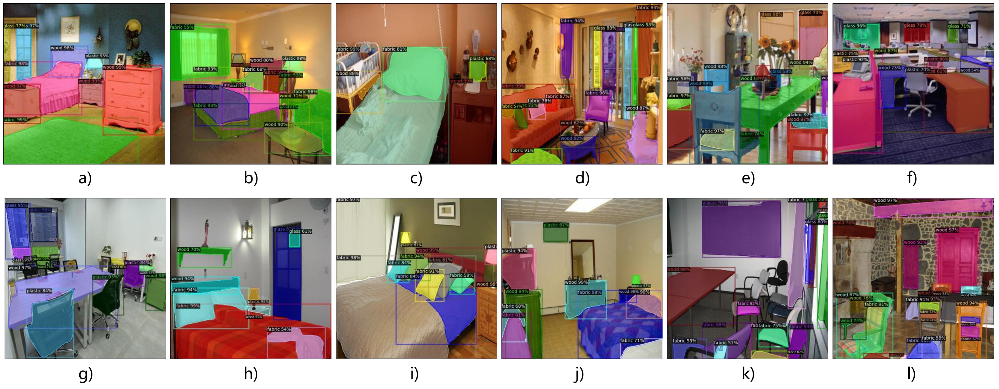

# Fire Load Detection
Indoor fire load detection using deep learning-based instance segmentation.




## Dataset Information

The [data/indoor-scene/trainval1k.zip](https://github.com/Zhou-Yucheng/fire-load-detection/tree/main/data/indoor-scene/trainval1k.zip) is the dataset containing all images with annotations developed in this research.  


## Setup & Usage

- Install [Pytorch 1.6+](https://pytorch.org/) and [detectron2](https://github.com/facebookresearch/detectron2)
  
- Clone or download the repo  
```
git clone https://github.com/Zhou-Yucheng/fire-load-detection.git
cd fire-load-detection/src
```

- Unzip the dataset trainval1k.zip in data/indoor-scene

- Run `python3 train.py --help` for more information about usage

- Run train.py with arguments, for example:
```
python3 train.py -m R50 -b 4 -l 2e-3 -i 6k --step 4k
```
